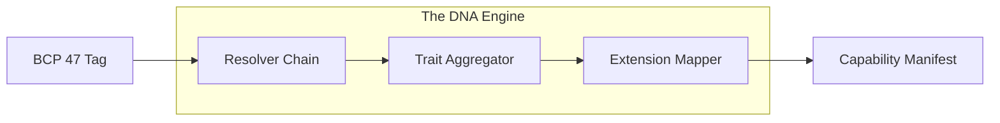

# Bistun LMS: The Linguistic System of Record

[](https://github.com/fwazeter/bistun/actions)
[](https://www.gnu.org/licenses/gpl-3.0)
[](#)

Bistun LMS is a high-performance **Linguistic Metadata Service** designed to serve as the "System of Record" for software locales. It transforms complex cultural variables into functional "Linguistic DNA" by synthesizing **ISO 639-3**, **ISO 15924**, and **BCP 47** standards.

---

## ⚡ Key Technical Innovations

* **Sub-Millisecond Resolution**: Architected for a **< 1ms** p99 latency budget via optimized Flyweight pools.
* **Memory Efficiency**: $>80\%$ reduction in memory footprint through immutable instance sharing.
* **Atomic Hot-Swaps**: Background registry hydration and atomic pointer swaps for zero-downtime updates.
* **Cryptographic Integrity**: JWS registry signing and mandatory SDK-side verification.

---

## 🏗️ Core Architecture



---

## 🚀 Getting Started

### Prerequisites
* Rust Stable (2024 Edition)
* [Just](https://github.com/casey/just) task runner

### Quick Start
To verify the project meets all architectural and performance standards:
```bash
just verify-all
```

To run the scientific performance benchmarks:
```bash
just bench-critical
```

---

## 📚 Documentation Map

The project features a multi-layered documentation suite in the `docs/` directory:

1.  **Foundations**: High-level vision and algorithms (`docs/foundations/`).
2.  **Blueprints**: Detailed implementation specifications (`docs/blueprints/`).
3.  **Standards**: Engineering rules for code and AI agents (`docs/standards/`).
4.  **Processes**: Operational guides for CI, releases, and errors (`docs/processes/`).

See [docs/foundations/00-system-overview.md](docs/foundations/00-system-overview.md) for the authoritative service map.

---

**Author**: Francis Xavier Wazeter IV  
**License**: GNU GPL v3
