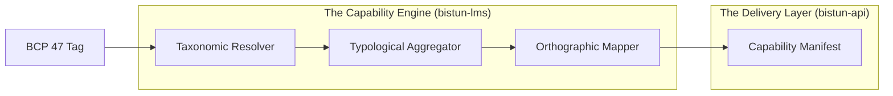

# Bistun LMS: The Linguistic System of Record

[](https://github.com/fwazeter/bistun/actions)
[](https://www.gnu.org/licenses/gpl-3.0)
[](#)

---
Bistun LMS is a high-performance **Linguistic Metadata Service** designed to serve as the "System of Record" for software locales. It transforms complex cultural variables into functional **Typological**, **Orthographic**, and **Taxonomic** capabilities by synthesizing **ISO 639-3**, **ISO 15924**, and **BCP 47** standards.

## 💡 Elevator Pitch

**What is this?** Imagine you are building a global application and need to know exactly how a specific language (like Thai or Arabic) behaves—how it's written, how words are separated, and how it should look on a screen.

The **Bistun Linguistic Metadata Service (LMS)** acts like a **Linguistic DNA Reader**. It transforms complex cultural variables into functional **Taxonomic**, **Typological**, and **Orthographic** capabilities. By synthesizing **ISO 639-3**, **ISO 15924**, and **BCP 47** standards, it provides an "instruction manual" (a manifest) that tells your software exactly how to handle a language's unique rules without requiring a resident linguist.

---

## I. Strategic Overview

### 1. The "Why"

Bistun LMS exists to decouple cultural metadata from application logic. It serves as a standalone workspace that centralizes the 5-phase resolution pipeline (**Resolve → Aggregate → Resource → Override → Integrity → Telemetry**) to ensure every service in a global stack renders text with 100% regional accuracy.

### 2. System Impact

If this system is compromised or misconfigured, downstream UI and NLP pipelines lose their ability to adapt to regional languages. This results in catastrophic rendering failures for complex scripts and destroys international search indexing accuracy.

### 3. Domain Alignment

This monorepo orchestrates the three pillars of global software delivery:

* **Taxonomy**: Locale identification and fallback (BCP 47).
* **Typology**: Structural rules (Segmentation, Morphology).
* **Orthography**: Rendering mechanics (Directionality, Shaping).

---

## 🏗️ Workspace Architecture

The Bistun LMS is organized as a high-performance Rust workspace, separating data foundations from engine logic and delivery.

### 1. The Component Stack

* **`bistun-core`**: The foundational "Linguistic DNA" models, DTOs, and error narratives.
* **`bistun-lms`**: The core 5-phase execution engine and wait-free memory pool (`ArcSwap`).
* **`bistun-api`**: The production sidecar—an Axum-based HTTP delivery layer for the capability engine.
* **`curator`**: An administrative CLI tool used for the cryptographic signing of WORM snapshots.

### 2. Internal Logic Flow



---

## 🚀 Getting Started: The Walkthrough

Follow these steps to instantiate the Bistun LMS as a "System of Record" in your environment.

### Step 1: Clone and Verify

Clone the repository and verify the workspace meets all architectural and performance standards via the `just` task runner.

```bash
git clone https://github.com/fwazeter/bistun.git
cd bistun
just verify-all
```

### Step 2: The Cryptographic Ceremony

Bistun requires a cryptographically signed WORM (Write-Once, Read-Many) snapshot to operate in production. Use the `curator` tool to generate your keys and sign the default snapshot.

```bash
cargo run -p bistun-api --bin curator
```

* **Action**: Copy the generated `PUBLIC_KEY` and paste it into a new `.env` file at the root.

### Step 3: Configure Environment

Create your environment file based on the template.

```bash
cp .env.example .env
# Edit .env and paste your CURATOR_PUBLIC_KEY
```

### Step 4: Launch the Atomic Capability Sidecar

Start the high-performance Axum server. The engine will hydrate its in-memory pool and verify the snapshot's signature during boot.

```bash
# Option A: Local Rust execution
cargo run -p bistun-api

# Option B: Dockerized sidecar
just docker-build
just docker-run
```

### Step 5: Resolve Linguistic DNA

Verify the implementation by requesting a "Golden Path" capability manifest via cURL.

```bash
curl -s http://localhost:8080/v1/manifest/th-TH
```

* **Expected Result**: A JSON manifest containing Thai segmentation strategies, LTR directionality, and required ICU4X resource pointers.

---

## 📚 Documentation Map

The project features a multi-layered documentation suite in the `docs/` directory, serving as the authoritative guide for both humans and AI agents.

1. **[Foundations](https://www.google.com/search?q=docs/foundations/)**: High-level vision, service maps, and algorithmic whitepapers.
2. **[Blueprints](https://www.google.com/search?q=docs/blueprints/)**: Detailed implementation specifications for every module (e.g., `001-LMS-CORE`).
3. **[Standards](https://www.google.com/search?q=docs/standards/)**: Engineering rules including **LMS-DOC**, **LMS-TEST**, and the project **Glossary**.
4. **[Interfaces](https://www.google.com/search?q=docs/interfaces/)**: Specifications for the Curator UI and CLI tools.
5. **[Processes](https://www.google.com/search?q=docs/processes/)**: Operational guides for CI, release management, and error narratives.

---

## 🛠️ Operations & Development

### 1. Scientific Benchmarking

To prove the system meets its **< 1ms** latency budget, run the performance verification suite:

```bash
just bench-critical

```

### 2. Extension Guide

To extend any component in this workspace:

1. **Red Phase**: Add a failing test case in the relevant crate's `tests/` directory.
2. **Logic Trace**: Document your proposed implementation steps using the **LMS-DOC** `# Logic Trace` format.
3. **Implementation**: Mirror the trace with `// [STEP X]` comments in the source code.

---

## V. Metadata

* **Author**: Francis Xavier Wazeter IV
* **Status**: Production Baseline
* **License**: GNU GPL v3 (or later)
* **Date Created**: 04/29/2026
* **Date Updated**: 05/08/2026