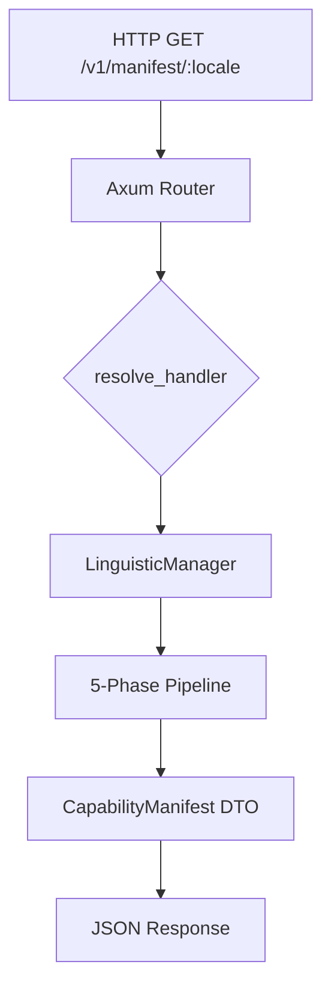
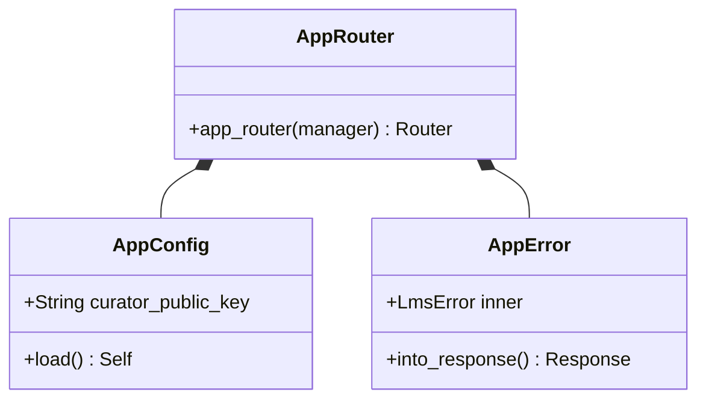

# `bistun-api`: The High-Performance BCP 47 Resolution Sidecar

[](#)
[](#)
[](#)

---

## 💡 Elevator Pitch

**What is this?** `bistun-api` is the containerized HTTP delivery layer for the Bistun ecosystem. It encapsulates the `bistun-lms` capability engine and its 5-phase resolution pipeline within a high-performance, asynchronous Axum web server.

By mapping incoming BCP 47 language tags to the immutable `CapabilityManifest` DTOs defined in `bistun-core`, it provides a standardized, language-agnostic interface for sub-millisecond linguistic metadata resolution. It acts as the authoritative gateway, managing environment-driven configuration, cryptographic WORM snapshot hydration, and system-wide telemetry for high-throughput NLP and UI consumers.

---

## I. Strategic Overview

### 1. The "Why"

`bistun-api` exists as a standalone microservice to decouple the complex 5-phase resolution logic of the `bistun-lms` engine from downstream application code. It serves as the primary ingress point, ensuring that capability resolution is performed against a cryptographically verified, in-memory Flyweight pool.

### 2. System Impact

If this service is compromised or unavailable, external consumers cannot resolve linguistic traits, causing a total failure of the capability delivery pipeline. This results in downstream systems defaulting to unverified state, breaking regional accuracy and multilinguality across the stack.

### 3. Domain Alignment

This crate operates primarily within the **Taxonomy** and **Typology** domains, providing the mechanisms for locale classification and trait-based capability mapping.

---

## 🏗️ Technical Architecture

### 1. Internal Logic Flow

The following diagram illustrates how an HTTP request moves through the sidecar to the core engine:



### 2. Component Relationship



---

## 📚 Technical Interface

### 1. Primary API Endpoints

The sidecar exposes authoritative endpoints for capability resolution and operational health:

| Function/Endpoint | Input Type | Output/Type | Purpose |
| --- | --- | --- | --- |
| `GET /v1/manifest/:locale` | `Path<String>` | `Json<CapabilityManifest>` | Resolves a BCP 47 tag into a canonical DNA manifest. |
| `GET /health` | `N/A` | `Json<HealthResponse>` | Returns SdkState and sync telemetry. |

### 2. Side Effects & SLIs

* **Performance**: Target latency: `< 1ms`. Measured resolution overhead: **~1.88 µs**.
* **Observability**: Records spans and logic traces via `tracing` for every request per **007-LMS-OPS**.

---

## 🚀 Usage & Implementation

### 1. The "Golden Path" Example

To programmatically embed the API's router into a custom Axum host application:

```rust
use axum::Router;
use bistun_api::routes;
use bistun_lms::LinguisticManager;

#[tokio::main]
async fn main() {
    // [STEP 1]: Initialize the capability orchestrator
    let manager = LinguisticManager::new();

    // [STEP 2]: Extract versioned sidecar routes
    let bistun_router = routes::app_router(manager);

    // [STEP 3]: Nest under a custom path in a larger host
    let _app = Router::new()
        .nest("/bistun-lms", bistun_router);
}

```

---

## 🛠️ Development & Contribution

### 1. Building and Testing

To ensure this crate maintains its "System of Record" integrity:

* **Check Logic**: `cargo test -p bistun-api`
* **Verify SLIs**: `cargo bench -p bistun-api`

### 2. Extension Guide

To add a new feature to this crate:

1. **Red Phase**: Add a failing integration test in `tests/api_integration.rs`.
2. **Logic Trace**: Document proposed steps in the PR using the **LMS-DOC** `# Logic Trace` format.
3. **Implementation**: Mirror the trace with `// [STEP X]` comments in the code.

---

## V. Metadata

* **Author**: Francis Xavier Wazeter IV
* **Version**: 1.0.0
* **License**: GNU GPL v3
* **Date Created**: 2026-05-02
* **Date Updated**: 2026-05-08