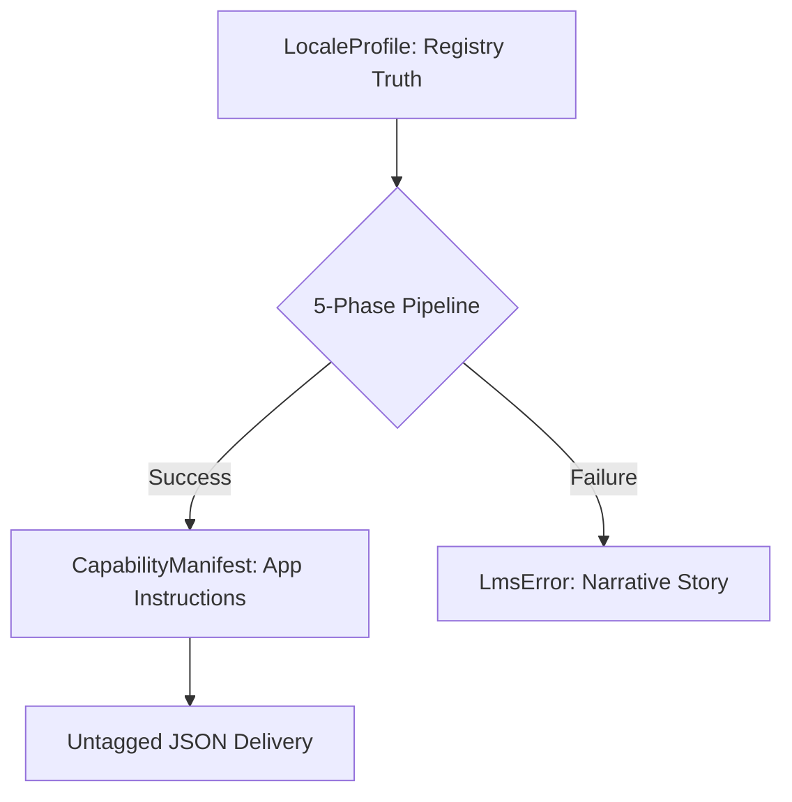

# bistun-core: The Linguistic DNA & Authority Schema

[-blue.svg)](#)
[](#)
[](#)

---

## 💡 Elevator Pitch
**What is this?** Think of **bistun-core** as the "Universal Blueprint" for every language your software touches. It defines the **Linguistic DNA**—the fundamental rules for how text is written, shaped, and separated—and packages them into an immutable instruction manual (a manifest) for your applications. It acts as the authoritative "Contract Layer," ensuring that every tool in the Bistun universe—from the UI to the search engine—speaks the same language and follows the same rules, no matter how complex the linguistic physics get.

---

## I. Strategic Overview

### 1. The "Why"
`bistun-core` serves as the **Authoritative Schema** for the entire monorepo. It provides the zero-dependency, immutable models required to serialize linguistic truth and failure narratives between the persistence layer (WORM registry) and consuming sidecars/SDKs.

### 2. System Impact
This crate defines the **System of Record's Contract**; if the `CapabilityManifest` or `LmsError` structures are altered without a major version bump, the communication between the capability engine and its global clients will instantly collapse.

### 3. Domain Alignment
This crate operates as the **Foundation** for the **Typology** and **Orthography** pillars, standardizing the "Algebraic Data Types" used to describe language behavior.

---

## 🏗️ Technical Architecture

### 1. Internal Logic Flow: The Lifecycle of Truth
This crate manages the transition from persisted linguistic "Blueprints" to a "Narrative Failure" or a "Resolved Manifest":



### 2. Feature-Gated Domains
To maintain our **Zero-Overhead** standard, the crate is partitioned into granular, opt-in domains:

| Feature | Components Included | Primary Target |
| :--- | :--- | :--- |
| **`default`** | `traits`, `manifest`, `error` | All Consumers |
| **`persistence`** | `registry` (`LocaleProfile`, `WormPayload`) | Engine, Curator, Linter |
| **`ops`** | `ops` (`SdkState`, `SyncMetrics`) | API, Sidecar, Dashboards |
| **`testing`** | `simulation` (Golden Data Set) | QA, Dev Apps |
| **`full`** | All components | Monorepo Developers |

---

## 📚 Technical Interface

### 1. Primary Authority Objects
These objects define the "Physics" of our linguistic metadata.

| Object | Type | Purpose |
| :--- | :--- | :--- |
| `LocaleProfile` | **Persistence** | The "Ground Truth" structure for the WORM registry. |
| `CapabilityManifest` | **Transmission** | The package of instructions delivered to consumers. |
| `WormPayload` | **Contract** | The top-level WORM JSON container. |
| `LmsError` | **Narrative** | Strongly-typed errors that explain "What, Where, and Why". |

### 2. Side Effects & SLIs
* **Performance**: Target latency: **< 0.01ms** (zero-copy DTO hydration).
* **Observability**: Every `LmsError` carries a `pipeline_step` and `context` field for automated SLI tracking.

---

## 🧪 Simulation & Golden Data
Enabled via the `testing` feature, this module provides authoritative models for development without "Mock Drift."

* **Authoritative Profiles**: Pre-constructed `LocaleProfile` instances for English, Arabic, Thai, Japanese, Pali, and Sanskrit.
* **WORM Simulation**: The `SIMULATED_WORM_JSON` string used for zero-I/O engine tests.

---

## 🚀 Usage & Implementation

### 1. The "Golden Path" (Construction and Serialization)
```rust
use bistun_core::{CapabilityManifest, Direction, LmsError, TraitKey, TraitValue};

fn main() -> Result<(), LmsError> {
    // [STEP 1]: Represent a successful instruction set
    let mut manifest = CapabilityManifest::new("he-IL".to_string());
    manifest.traits.insert(TraitKey::PrimaryDirection, TraitValue::Direction(Direction::RTL));

    // [STEP 2]: Serialize to professional Untagged JSON
    let json = serde_json::to_string(&manifest).map_err(|_| LmsError::SecurityFault {
        pipeline_step: "Serialization".into(),
        context: "CapabilityManifest".into(),
        reason: "Failed to encode DNA".into(),
    })?;

    Ok(())
}
```

---

## 🛠️ Development & Extension

### 1. Building and Testing
* **Check Data Rules**: `cargo test -p bistun-core --all-features`
* **Verify Blueprints**: `cargo doc -p bistun-core --open`

### 2. Extension Guide
To add a new linguistic property to the **System of Record**:
1. **Define**: Add the variant to `traits.rs` with `#[serde(rename_all = "UPPERCASE")]`.
2. **Blueprinting**: Update `LocaleProfile` in `registry.rs` and `TraitValue` in `manifest.rs`.
3. **Verify**: Update the `simulation.rs` golden set and add a serialization test.

---

## ⚖️ Legal & Contribution

To maintain the integrity of the **Bistun System of Record**, all workspace members adhere to the global project standards:

* **Security Policy**: Please review our [SECURITY.md](../../SECURITY.md) for reporting vulnerabilities and understanding our security tiers.
* **Contribution Guidelines**: See our global [CONTRIBUTING.md](../../CONTRIBUTING.md) for details on the **LMS-TEST** and **LMS-DOC** standards required for all PRs.
* **License**: This crate is licensed under the **GNU GPL v3**, as detailed in the root [LICENSE](../../LICENSE) file.

## V. Metadata
* **Author**: Francis Xavier Wazeter IV
* **Version**: 1.0.0
* **License**: GNU GPL v3
* **Date Created**: 2026-04-29
* **Date Updated**: 2026-05-07
