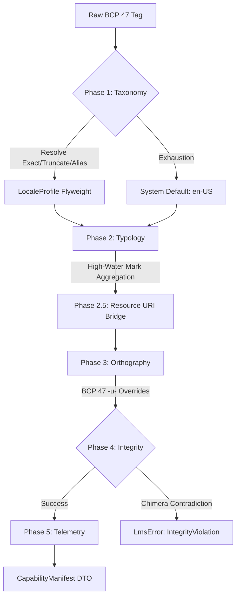
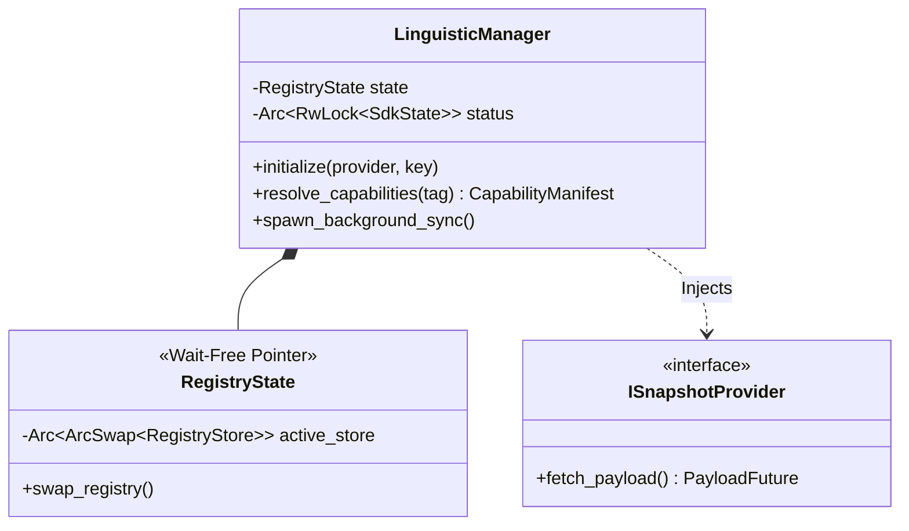

# bistun-lms: The 5-Phase Capability Engine

[](#)
[](#)
[](#)

---

## 💡 Elevator Pitch
**What is this?** Imagine you are building a global app and need to know exactly how a specific language (like Thai or Arabic) behaves—how it's written, how words are separated, and how it should look on a screen. 

This crate acts like a **Linguistic DNA Reader**. It takes a simple language code (e.g., `ar-EG-u-nu-latn`) and gives you an "instruction manual" (a manifest) that tells your software exactly how to handle that language's unique rules without you having to be a linguist. Under the hood, it features a wait-free, lock-free memory pool (`ArcSwap`) enabling zero-downtime registry hot-swaps for high-throughput NLP and UI pipelines.

---

## I. Strategic Overview

### 1. The "Why"
Global software requires highly specific instructions on how to render text, shape fonts, and segment words based on region. `bistun-lms` abstracts the complexity of ISO standards and RFC 4647 fallback chains behind a unified 5-Phase Pipeline (Resolve → Aggregate → Resource → Override → Integrity → Telemetry), delivering a deterministic, sub-microsecond payload to downstream clients.

### 2. System Impact
As the primary Atomic Capability Provider, if this engine goes down, downstream UIs and NLP pipelines lose their ability to adapt to regional languages. This results in catastrophic rendering failures for complex scripts (like Arabic, Thai, or Japanese) and destroys international search indexing accuracy.

### 3. Domain Alignment
This crate operates primarily within the **Orchestration** domain, seamlessly coordinating the **Taxonomy**, **Typology**, and **Orthography** domains of the Bistun ecosystem into a single Execution Pipeline.

---

## 🏗️ Technical Architecture

### 1. Internal Logic Flow
The following diagram illustrates how raw user input is transformed into immutable Linguistic DNA:



### 2. Component Relationship

The `LinguisticManager` maintains thread-safe access to the data while abstracting I/O:



---

## 📚 Technical Interface

### 1. Primary API / Data Schema

| Function/Field | Input Type | Output/Type | Purpose |
| --- | --- | --- | --- |
| `initialize()` | `ISnapshotProvider`, `&str` | `()` | Hydrates the initial memory pool and verifies JWS signatures. |
| `resolve_capabilities()` | `&str` (Tag) | `Result<CapabilityManifest>` | Executes the hot-path 5-Phase pipeline. |
| `spawn_background_sync()` | `u64`, `ISnapshotProvider` | `()` | Spawns a Tokio task for zero-downtime background hot-swaps. |
| `status()` | `N/A` | `SdkState` | Returns operational health (Bootstrapping, Ready, Degraded). |

### 2. Feature Flags

To support strict binary sizes in WASM or Edge runtimes, dependencies are heavily gated:

* **`default`**: `["fs", "network", "async-worker"]`
* **`fs`**: Enables `FileSnapshotProvider` (`tokio/fs`).
* **`network`**: Enables `HttpSnapshotProvider` (`reqwest`).
* **`async-worker`**: Enables `spawn_background_sync` and Tokio time/rt dependencies.
* **`simulation`**: Compiles hermetic golden data and dynamic Ed25519 generation for tests.

### 3. Side Effects & SLIs

* **Performance**: Target latency: `< 1.0ms`. Proven execution on warm cache: **~880ns**. Complexity: `O(N)` based on subtag length.
* **Observability**: Records resolution path and fractional millisecond latency directly into the manifest metadata map per **007-LMS-OPS**.

---

## 🚀 Usage & Implementation

### 1. The "Golden Path" Example

Requires features: `["async-worker", "simulation"]`

```rust
use bistun_lms::LinguisticManager;
use bistun_lms::data::repository::SimulatedSnapshotProvider;

#[tokio::main]
async fn main() -> Result<(), Box<dyn std::error::Error>> {
    // [STEP 1]: Initialize the manager and provider
    let manager = LinguisticManager::new();
    let provider = SimulatedSnapshotProvider::new();

    // [STEP 2]: Hydrate the Engine
    manager.initialize(&provider, &provider.public_key).await;

    // [STEP 3]: Execute the < 1ms hot-path resolution
    let manifest = manager.resolve_capabilities("ar-EG-u-nu-latn")?;

    println!("Resolved Locale: {}", manifest.resolved_locale);
    println!("Telemetry: {}ms", manifest.metadata.get("resolution_time_ms").unwrap());
    
    Ok(())
}

```

---

## 🛠️ Development & Contribution

### 1. Building and Testing

To ensure this crate maintains its "System of Record" integrity, use the following commands:

* **Check Logic**: `cargo test -p bistun-lms --all-features`
* **Verify Performance**: `cargo bench -p bistun-lms --all-features`
* **Verify Docs**: `cargo doc -p bistun-lms --all-features --open`

### 2. Extension Guide

To add a new feature to this crate:

1. **Red Phase**: Add a failing test case in `tests/engine_integration.rs` or the internal `mod tests`.
2. **Logic Trace**: Document your proposed implementation steps using the **LMS-DOC** `# Logic Trace` format.
3. **Implementation**: Mirror the trace with `// [STEP X]` comments in the code.

---

## ⚖️ Legal & Contribution

To maintain the integrity of the **Bistun System of Record**, all workspace members adhere to the global project standards:

* **Security Policy**: Please review our [SECURITY.md](../../SECURITY.md).
* **Contribution Guidelines**: See our global [CONTRIBUTING.md](../../CONTRIBUTING.md) for **LMS-TEST** and **LMS-DOC** details.
* **License**: This crate is licensed under the **GNU GPL v3 (or later)**, as detailed in the root [LICENSE](./LICENSE) file.

---

## V. Metadata

* **Author**: Francis Xavier Wazeter IV
* **Version**: 1.0.0
* **License**: GNU GPL v3 (or later)
* **Date Created**: 2026-05-02
* **Date Updated**: 2026-05-08
