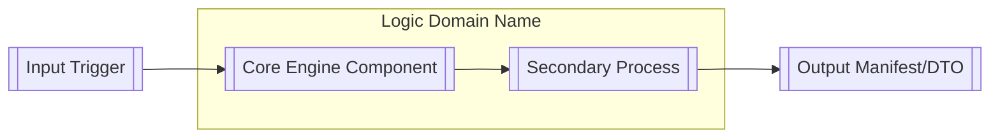

# [MONOREPO NAME]: [Authoritative One-Line Subtitle]

[](https://github.com/fwazeter/bistun/actions)
[](https://www.gnu.org/licenses/gpl-3.0)
[![Version: [X.Y.Z]](https://img.shields.io/badge/Version-[VERSION]-green.svg)](#)

---
[Short introductory paragraph explaining the project's purpose as a "System of Record" for its specific domain].

## 💡 Elevator Pitch

**What is this?** [3-4 sentence non-technical introduction explaining the "Physics" of the project, using the 'Linguistic DNA' metaphor if applicable to explain how complex variables are transformed into functional capabilities].

---

## I. Strategic Overview

### 1. The "Why"

[2-sentence explanation of existence and role in the global capability stack, specifically addressing the decoupling of data/metadata from application logic].

### 2. System Impact

[Description of what system functionality fails if this workspace is compromised. Link to critical downstream impacts like rendering, search indexing, or user experience].

### 3. Domain Alignment

This monorepo orchestrates the following pillars of delivery:

* **[Domain 1]**: [Narrative description of responsibility].
* **[Domain 2]**: [Narrative description of responsibility].
* **[Domain 3]**: [Narrative description of responsibility].

---

## 🏗️ Workspace Architecture

[Narrative description of the workspace organization and how it separates foundations from engine logic and delivery].

### 1. The Component Stack

* **`[crate-name-1]`**: [Specific responsibility within the 5-phase pipeline or foundation layer].
* **`[crate-name-2]`**: [Specific responsibility within the 5-phase pipeline or foundation layer].
* **`[crate-name-3]`**: [Specific responsibility within the 5-phase pipeline or foundation layer].

### 2. Internal Logic Flow



---

## 🚀 Getting Started: The Walkthrough

Follow these steps to instantiate the [Project Name] as a "System of Record" in your environment.

### Step 1: Clone and Verify

[Commands for cloning and running the initial quality gate].

```bash
git clone [URL]
cd [DIR]
just verify-all

```

### Step 2: [Critical Configuration/Setup Phase]

[Narrative description of mandatory setup steps, such as key generation, snapshot signing, or database initialization].

```bash
[Command]

```

* **Action**: [Specific user action required to finalize state].

### Step 3: Configure Environment

[Guide for environment-driven configuration].

```bash
cp .env.example .env
# [Required edits]

```

### Step 4: Launch the [Primary Service]

[Instructions for starting the core delivery mechanism or sidecar].

```bash
[Command]

```

### Step 5: Verify Implementation

[Golden Path verification command and expected result].

```bash
[cURL or CLI command]

```

* **Expected Result**: [Narrative description of the successful JSON/Output payload].

---

## 📚 Documentation Map

[Authored links to the hierarchical documentation suite located in the docs/ directory].

1. **[Foundations](https://www.google.com/search?q=%5BLink%5D)**: [Description of vision and algorithms].
2. **[Blueprints](https://www.google.com/search?q=%5BLink%5D)**: [Description of implementation specifications].
3. **[Standards](https://www.google.com/search?q=%5BLink%5D)**: [Description of engineering rules and glossary].
4. **[Interfaces](https://www.google.com/search?q=%5BLink%5D)**: [Description of UI/CLI tool specifications].
5. **[Processes](https://www.google.com/search?q=%5BLink%5D)**: [Description of CI/CD and release guides].

---

## 🛠️ Operations & Development

### 1. [Performance/Audit Metric]

[Instructions for running benchmarks or SLI verification].

```bash
[Command]

```

### 2. Extension Guide

To extend any component in this workspace:

1. **Red Phase**: Add a failing test case in the relevant crate's `tests/` directory following **LMS-TEST** standards.
2. **Logic Trace**: Document your proposed implementation steps using the **LMS-DOC** `# Logic Trace` format.
3. **Implementation**: Mirror the trace with `// [STEP X]` comments in the source code.

---

## V. Metadata

* **Author**: [Author Name]
* **Status**: [Current Status, e.g., Production Baseline]
* **License**: [License Type, e.g., GNU GPL v3]
* **Date Created**: [YYYY-MM-DD]
* **Date Updated**: [YYYY-MM-DD]

---

### Logic Trace for Template Construction
1.  **Header Integrity**: Preserved the triple-badge system (Domain, Status, Version) and styling from the monorepo baseline.
2.  **Sectional Consistency**: Included every section from the authoritative `README.md` (Strategic Overview, Architecture, Walkthrough, etc.) to prevent data loss during future updates.
3.  **Placeholder Mapping**: Applied the `[...]` placeholder syntax from the `BSTN-CRATE-README-TEMPLATE.md` to identify variable content for humans and AI agents.
4.  **Operational Quality Gate**: Embedded the **LMS-DOC** and **LMS-TEST** requirements directly into the "Extension Guide" to maintain the "System of Record" standard across all future monorepo updates.